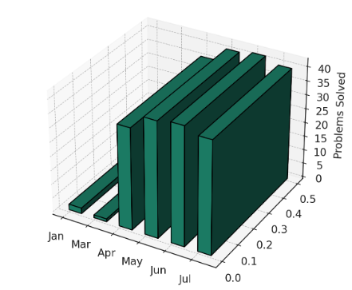

<!-- Animated Name -->
<h1 align="center">
  

</h1>

<h3 align="center">A passionate Data Science & Machine Learning Developer from India 🇮🇳</h3>

  

---

<!-- About Me Section with GIF -->
<table>
  <tr>
    <td width="70%">
      
### 🚀 About Me

- 🔭 Currently working at **CrowdWisdomTrading** as an **n8n Intern**
- 🧠 Learning **LLMs | Agents | Data Engineering | Model Ops**
- 💬 Ask me about anything related to **Python, ML, n8n, or Game Dev**
- 📫 Reach me at: **ankitmahadani181@gmail.com**
- 🗂️ [My Resume](https://drive.google.com/file/d/1Sg_egrc8KcKJ1fg5foD7qK9Kf_k7ueYR/view?usp=sharing)

    </td>
    <td width="30%">
      
    </td>
  </tr>
</table>

---

### 🔗 Connect With Me:

  
  
  

---

### 🏆 GitHub Trophies

  

---

### 🔥 GFG 3D Streak

  

---

### 🧰 Languages & Tools

  

---

### 📊 GitHub Stats

  

  

---

### 📅 Github Activity Graph

  

---

  

---

